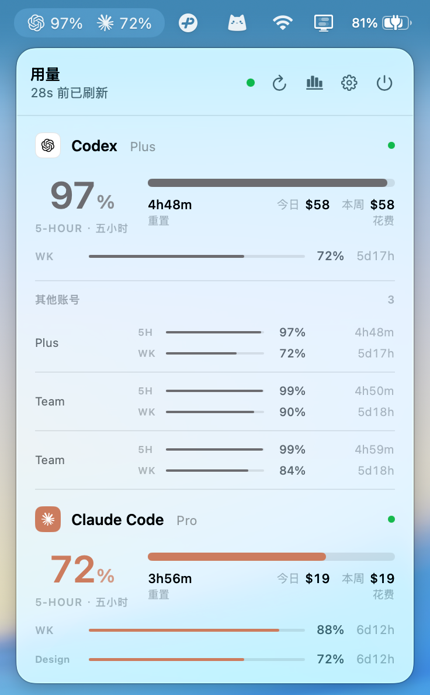
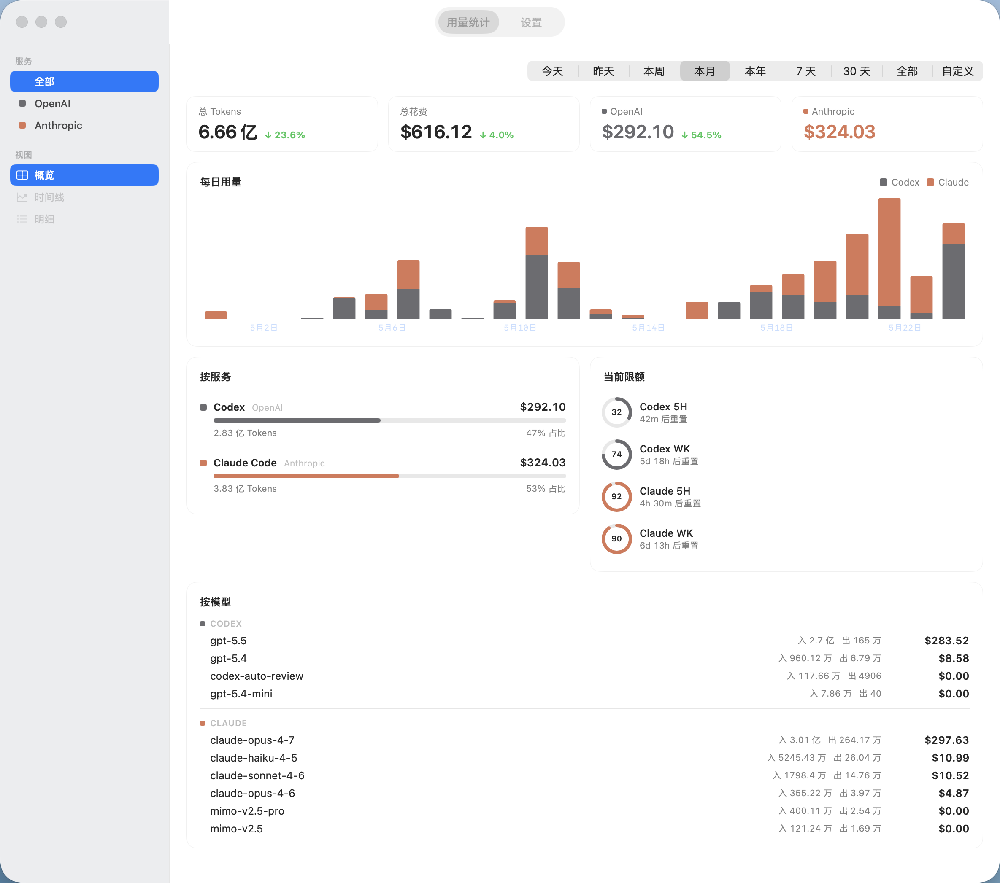

# cc-bar

> macOS 菜单栏小工具 —— 一眼看清 Codex 与 Claude Code 的用量与花费。

<p>
  
  
  
</p>

<p align="center">
  
</p>

## 功能

- **用量显示** —— Codex 与 Claude Code 的 5 小时 / 周窗口剩余额度,实时同步
- **菜单栏 + 悬浮窗** —— 状态栏图标显示剩余百分比;可选桌面悬浮 HUD,可拖动、边缘吸附、置顶不抢焦
- **多 Codex 账号** —— 支持导入多个 Codex 账号,主副账号在 Popover 同屏展示
- **Token 与费用统计** —— 按今天 / 昨天 / 本周 / 本月 / 本年 / 7 天 / 30 天 / 全部 / 自定义切换;KPI、堆叠柱状图、按服务占比、按模型明细
- **丰富的设置** —— 账号开关、菜单栏显示项、悬浮窗、刷新间隔、重置时间显示、中英双语、开机自动启动

<p align="center">
  
</p>

## 安装

要求 macOS 14 Sonoma 或更新版本。已通过终端完成 `codex login` 与 `claude` 登录。

1. 到 [Releases](https://github.com/nanvon/cc-bar/releases) 下载最新 `CCBar.app.zip`,解压后把 `CCBar.app` 拖入 `/Applications`。

2. 首次启动会被 Gatekeeper 拦下。在「应用程序」里**右键 → 打开**,或在终端执行:

   ```bash
   xattr -d com.apple.quarantine /Applications/CCBar.app
   ```

3. 若本机无 `~/.claude/.credentials.json`,会弹出说明后请求 Keychain 授权,请选「**始终允许**」。

## 反馈

请到 [Issues](https://github.com/nanvon/cc-bar/issues) 留言。

## 致谢

cc-bar 在设计与实现上参考了以下优秀的开源项目,在此特别感谢:

- [cc-switch](https://github.com/farion1231/cc-switch) —— 多 Provider 账号切换器,启发了本项目的多账号管理与导入流程
- [cockpit-tools](https://github.com/jlcodes99/cockpit-tools) —— 多平台 AI 编码助手仪表盘,在额度与刷新策略上提供了参考
- [CodexBar](https://github.com/steipete/CodexBar) —— macOS 菜单栏 AI 用量监控,在菜单栏交互与本地解析思路上多有借鉴
